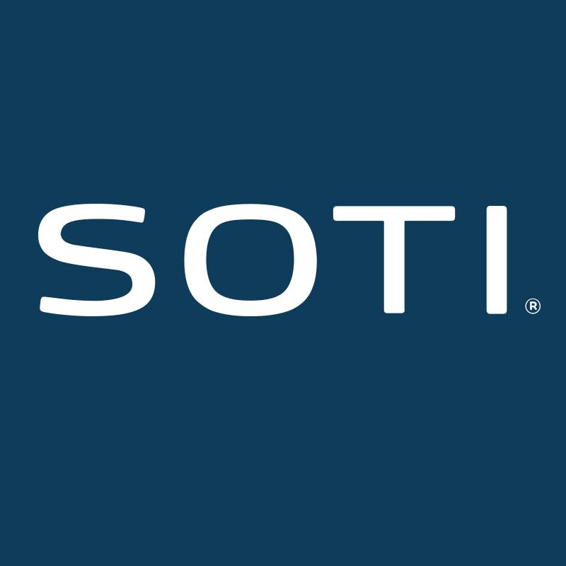
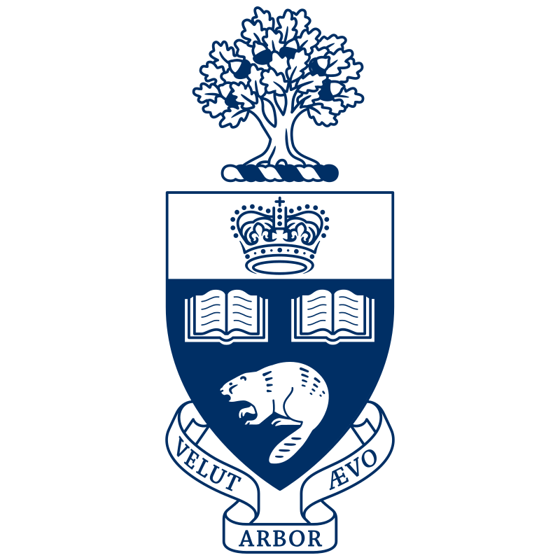

### Hi there 👋
I'm Bikram 

-  Just completed a Product Management internship at SOTI on Windows 10 Team this past year
-  Previously was a Software Engineer intern at Manulife where I worked on the insurance policy team 
-  I am a 4th-year Computer Engineering student at the University of Toronto with a minor in Artificial Intelligence 

<!--
**bikramjitnarwal/bikramjitnarwal** is a ✨ _special_ ✨ repository because its `README.md` (this file) appears on your GitHub profile.

Here are some ideas to get you started:

- 🔭 I’m currently working on ...
- 🌱 I’m currently learning ...
- 👯 I’m looking to collaborate on ...
- 🤔 I’m looking for help with ...
- 💬 Ask me about ...
- 📫 How to reach me: ...
- 😄 Pronouns: ...
- ⚡ Fun fact: ...
-->
